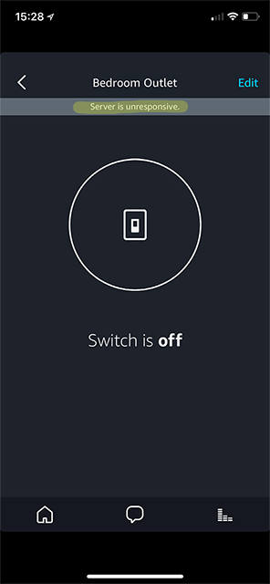

# Alexa Smart Home Skill Project from 3/23/2018
## Following ["Steps to Build a Smart Home Skill"](https://developer.amazon.com/docs/smarthome/steps-to-build-a-smart-home-skill.html)

1. Followed the directions to the "Finish configuring and test the Lambda function"
    * Found documentation bug while running test as TypeError was thrown
    * Lambda function details are incorrect for non-discovery request `request.directive.payload.scope.token` (see below)
2. Fixed documentation bug and built Lambda tests listed below (see "Lambda Tests")
3. Tests pass using the function console
4. Discovery using the Alexa Skill test saying "what devices do I have" finds "Bedroom Outlet"
    * Alexa Skill Test says to control "Bedroom Outlet", when doing so Alexa states "Hm, Bedroom Outlet is not responding."
    * Response output does not conform to schema
        * https://github.com/alexa/alexa-smarthome/wiki/Validation-Schemas
    * Found PowerController example response here and updated response to match schema
        * https://github.com/alexa/alexa-smarthome/tree/master/sample_messages/PowerController
5. "Bedroom Outlet" now turns on and off via voice command
    * However the Alexa app on iOS shows a "Server is unresponsive." banner when the "Bedroom Outlet" is selected (see "Screenshot #1")
    * Update Lambda to have an else case for an "Unknown request"
        * Found that Alexa is doing a "ReportState" request and no answer is delivered with current Lambda script
        * Found expected response for "ReportState" at ["Alexa Interface"](https://developer.amazon.com/docs/device-apis/alexa-interface.html#statereport)
    * Added function to handle a state report request
        * Additional work would be required to generate a state engine for the demo and is not currently done
        * The state report will always return "OFF" at this time until a state engine is implemented
6. After addition of code for the state report the Alexa app functions as expected

### NOTES
* Under Payload Version, select v3. You can no longer create new skills that that target v2.
* No link provided: "This name is appears in the AWS console and is also returned by the AWS command line interface (CLI)"
    * [https://docs.aws.amazon.com/cli/latest/userguide/installing.html](https://docs.aws.amazon.com/cli/latest/userguide/awscli-install-windows.html)
    * [Set Up the AWS Command Line Interface (AWS CLI)](https://docs.aws.amazon.com/lambda/latest/dg/setup-awscli.html)

### QUICK DEBUGGING
* Use the Amazon CloudWatch to determine the requests packages from the Alexa device
* Use the Alexa Skill Kit test "Alexa Simulator"
* [Validation Schemas](https://github.com/alexa/alexa-smarthome/wiki/Validation-Schemas)

### Finish configuring and test the Lambda function ([link](https://developer.amazon.com/docs/smarthome/steps-to-build-a-smart-home-skill.html#finish-configuring-and-test-the-lambda-function))
#### Example Expects
```js
    function handlePowerControl(request, context) {
        // get device ID passed in during discovery
        var requestMethod = request.directive.header.name;
        // get user token pass in request
        var requestToken = request.directive.payload.scope.token;
```

#### Alexa Request
```js
{
    "directive": {
        "header": {
            "namespace": "Alexa.PowerController",
            "name": "TurnOn",
            "payloadVersion": "3",
            "messageId": "908ca814-9d92-4b1d-b8c2-372408141c0c",
            "correlationToken": "TOKEN"
        },
        "endpoint": {
            "scope": {
                "type": "BearerToken",
                "token": "TOKEN"
            },
            "endpointId": "demo_id",
            "cookie": {
                "key1": "arbitrary key/value pairs for skill to reference this endpoint.",
                "key2": "There can be multiple entries",
                "key3": "but they should only be used for reference purposes.",
                "key4": "This is not a suitable place to maintain current endpoint state."
            }
        },
        "payload": {}
    }
}
```

The difference is the payload no longer carries the `request.directive.payload.scope.token` value like the Discovery request as it is now in the `request.directive.endpoint.scope.token` property.

### Lambda Tests
#### Discovery
```js
{
  "directive": {
      "header": {
        "payloadVersion": "3",
        "namespace": "Alexa.Discovery",
        "name": "Discover",
        "messageId": "F8752B11-69BB-4246-B923-3BFB27C06C7D"
      },
      "payload": {
        "scope": {
            "type": "BearerToken",
            "token": "access-token-from-skill"
        }
    }
  }
}
```
#### TurnOff
```js
{
    "directive": {
      "header": {
        "payloadVersion": "3",
        "namespace": "Alexa.PowerController",
        "name": "TurnOff",
        "messageId": "E2D17F2F-EBD0-4B1F-BB1E-8CEE81ADCBBC"
      },
      "payload": { },
        "endpoint": {
            "scope": {
                "token": true
            }
        }
    }
}
```
#### TurnOn
```js
{
  "directive": {
    "header": {
      "payloadVersion": "3",
      "namespace": "Alexa.PowerController",
      "name": "TurnOn",
      "messageId": "E2D17F2F-EBD0-4B1F-BB1E-8CEE81ADCBBC"
    },
    "payload": {},
    "endpoint": {
      "scope": {
        "token": true
      }
    }
  }
}
```
#### StateReport
```js
{
  "directive": {
    "header": {
      "namespace": "Alexa",
      "name": "ReportState",
      "payloadVersion": "3",
      "messageId": "766c3eed-2ad1-4f11-ad29-14263ce669b8",
      "correlationToken": "token"
    },
    "endpoint": {
      "scope": {
        "type": "BearerToken",
        "token": "TOKEN"
      },
      "endpointId": "demo_id",
      "cookie": {
        "key1": "arbitrary key/value pairs for skill to reference this endpoint.",
        "key2": "There can be multiple entries",
        "key3": "but they should only be used for reference purposes.",
        "key4": "This is not a suitable place to maintain current endpoint state."
      }
    },
    "payload": {}
  }
}
```

### Screenshots
#### Screenshot #1

